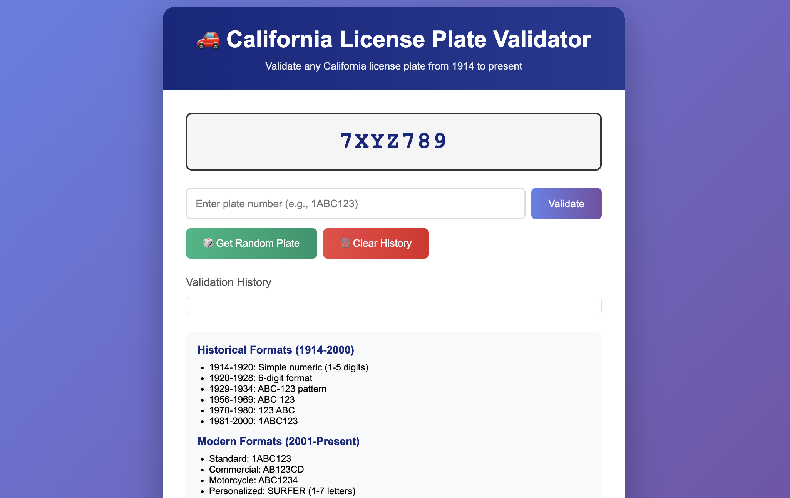
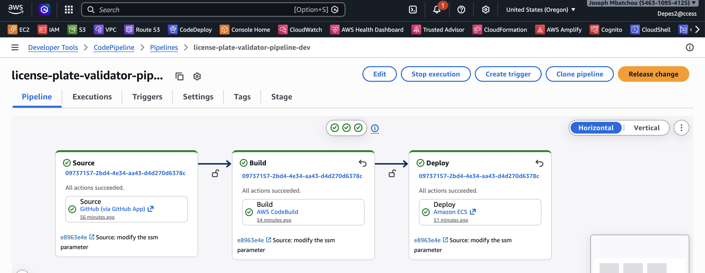

# License Plate Validator — AWS Pipeline Deployment

A California license plate validation web application deployed on AWS ECS Fargate with a fully automated CI/CD pipeline managed entirely by Terraform.

---

## Architecture

```
GitHub ──► CodePipeline ──► CodeBuild ──► ECR ──► ECS Fargate
  (push)    (orchestrate)   (build/push)  (store)   (run)
                                                       │
                                              Application Load Balancer
                                                       │
                                                   http://<alb-dns>
```

**AWS Services:**

| Service | Purpose |
|---------|---------|
| CodePipeline | Orchestrates Source → Build → Deploy |
| CodeBuild | Builds Docker image, pushes to ECR |
| ECR | Stores Docker images |
| ECS Fargate | Runs containerised Flask app |
| ALB | Routes HTTP traffic to ECS tasks |
| VPC | Isolated network with public/private subnets |
| NAT Gateway | Outbound internet for ECS tasks in private subnets |
| CloudWatch | Logs and container metrics |
| CodeStar Connections | GitHub integration (webhook trigger) |
| S3 | Terraform state backend + pipeline artifact store |

---

## Prerequisites

- [AWS CLI v2](https://docs.aws.amazon.com/cli/latest/userguide/install-cliv2.html) configured with `aws configure`
- [Terraform >= 1.0](https://developer.hashicorp.com/terraform/install)
- GitHub repository with this code (forked or cloned under your account/org)
- AWS IAM user with the following permissions:
  - AdministratorAccess **or** scoped permissions covering IAM, ECS, EC2, ECR, S3, CodeBuild, CodePipeline, CodeStar Connections, CloudWatch, SSM

---

## Step-by-Step Deployment

### Step 1 — Create the Terraform State S3 Bucket

Run this **once** before `terraform init`. The bucket must exist before Terraform can use it as a backend.


```bash
# Create bucket
aws s3api create-bucket \
  --bucket validator-license-bucket01 \
  --region us-west-2\
  --create-bucket-configuration LocationConstraint=us-west-2

# Enable versioning
aws s3api put-bucket-versioning \
  --bucket validator-license-bucket01 \
  --versioning-configuration Status=Enabled

# Enable encryption
aws s3api put-bucket-encryption \
  --bucket validator-license-bucket01 \
  --server-side-encryption-configuration '{
    "Rules": [{
      "ApplyServerSideEncryptionByDefault": {"SSEAlgorithm": "AES256"}
    }]
  }'

# Block public access
aws s3api put-public-access-block \
  --bucket validator-license-bucket01 \
  --public-access-block-configuration \
    "BlockPublicAcls=true,IgnorePublicAcls=true,BlockPublicPolicy=true,RestrictPublicBuckets=true"
```

Verify:
```bash
aws s3api get-bucket-versioning --bucket validator-license-bucket01
aws s3api get-bucket-encryption --bucket validator-license-bucket01
```

---

### Step 2 — Create and Approve the GitHub CodeStar Connection

Terraform uses this connection to link CodePipeline to GitHub. Run once.

```bash
aws codestar-connections create-connection \
  --provider-type GitHub \
  --connection-name licenses-plate-github \
  --region us-west-2
```

Copy the `ConnectionArn` from the output. Then **approve it in the AWS Console** (this GitHub OAuth step cannot be done via CLI):

> AWS Console → Developer Tools → Connections → `license-plate-github` → **Update pending connection** → authorize with GitHub

**Critical:** During the GitHub authorization flow, grant access to the GitHub user or organization that owns the repository. If you skip this, pushes will not trigger the pipeline.

To grant org access after the fact:
1. Go to `github.com/settings/apps/authorizations`
2. Find **AWS Connector for GitHub** → **Configure**
3. Under **Organization access** → click **Grant** next to your org

Verify the connection is AVAILABLE:
```bash
aws codestar-connections get-connection \
  --connection-arn YOUR_CONNECTION_ARN \
  --region us-west-2 \
  --query "Connection.ConnectionStatus"
```

Must return `"AVAILABLE"` before proceeding.

---

### Step 3 — Configure Terraform Variables

Create a local variables file from the committed example:

```bash
cp terraform/terraform.tfvars.example terraform/terraform.tfvars
```

Then edit `terraform/terraform.tfvars` and fill in your values:

```hcl
aws_region  = "us-west-2"
environment = "dev"

project_name     = "license-plate-validator"
container_port   = 8080
container_cpu    = 256
container_memory = 512
desired_count    = 1

vpc_cidr            = "10.0.0.0/16"
allowed_cidr_blocks = ["0.0.0.0/0"]

github_owner     = "Joebaho"
github_repo_name = "License-Plate-Validator"
github_branch    = "main"

dockerhub_username = "joebaho2"
dockerhub_password = ""

enable_alb_ssl  = false
certificate_arn = ""

create_dns  = false
domain_name = "joebahocloud.com"
subdomain   = "plates"

# Paste the ARN from Step 2
codestar_connection_arn = "arn:aws:codestar-connections:us-west-2:ACCOUNT_ID:connection/YOUR-ID"
```

Notes:
- Keep `terraform/terraform.tfvars` local only. It is gitignored and should never be committed.
- Leave `dockerhub_password = ""` if you are not pushing to Docker Hub.
- Leave `certificate_arn = ""` only when `enable_alb_ssl = false`.
- Set `create_dns = true` only if you already have a matching Route53 hosted zone.

---

### Step 4 — Grant IAM User the CodeStar PassConnection Permission

If your IAM user is not a full administrator, add this policy:

```bash
aws iam put-user-policy \
  --user-name YOUR_IAM_USERNAME \
  --policy-name CodeStarConnectionsPass \
  --policy-document '{
    "Version": "2012-10-17",
    "Statement": [{
      "Effect": "Allow",
      "Action": [
        "codestar-connections:PassConnection",
        "codestar-connections:UseConnection",
        "codestar-connections:GetConnection",
        "codestar-connections:ListConnections"
      ],
      "Resource": "*"
    }]
  }'
```

---

### Step 5 — Deploy Infrastructure with Terraform

```bash
cd terraform

# Download providers and connect to S3 backend
terraform init

# Preview what will be created
terraform plan -var-file="terraform.tfvars"

# Deploy all infrastructure (~10-15 minutes)
terraform apply -var-file="terraform.tfvars"
```

Type `yes` when prompted.

This creates: VPC, subnets, NAT Gateway, security groups, ALB, ECS cluster/service/task definition, ECR repository, IAM roles, CloudWatch log group, CodeBuild project, CodePipeline, and CodeStar connection.

After apply, note the outputs:
```bash
terraform output alb_dns_name       # Application URL
terraform output ecr_repository_url # ECR image repository
```

---

### Step 6 — Trigger the First Pipeline Run

The pipeline triggers automatically on every push to `main`. For the first run, trigger it manually:

```bash
aws codepipeline start-pipeline-execution \
  --name license-plate-validator-pipeline-dev \
  --region us-west-2
```

Or push a commit:
```bash
git add .
git commit -m "initial deployment"
git push origin main
```

---

### Step 7 — Monitor the Pipeline

```bash
aws codepipeline get-pipeline-state \
  --name license-plate-validator-pipeline-dev \
  --region us-west-2 \
  --query "stageStates[*].{Stage:stageName,Status:latestExecution.status}" \
  --output table
```

Expected progression:
```
Source    → Succeeded
Build     → Succeeded
Deploy    → Succeeded
```

View build logs:
```bash
aws logs tail /aws/codebuild/license-plate-validator-dev --follow --region us-west-2
```

---

### Step 8 — Access the Application

If `create_dns = true`, `enable_alb_ssl = true`, and your Route53 plus ACM configuration is valid, open:

`https://plates.joebahocloud.com`

If you are not using a custom domain, get the ALB DNS name directly:

```bash
terraform -chdir=terraform output alb_dns_name
```

By default, the starter configuration deploys without DNS or SSL, so the ALB endpoint is the expected first access path.

Available endpoints:

| Endpoint | Method | Description |
|----------|--------|-------------|
| `/` | GET | Web UI |
| `/api/health` | GET | Health check |
| `/api/validate` | POST | Validate a plate |
| `/api/bulk-validate` | POST | Validate multiple plates |
| `/api/random` | GET | Generate random plate |
| `/api/formats` | GET | List all plate formats |

---

## Resource Naming

All resources follow the pattern `{project_name}-{resource}-{environment}`:

| Resource | Name (dev) |
|----------|-----------|
| ECS Cluster | `license-plate-validator-cluster-dev` |
| ECS Service | `license-plate-validator-service-dev` |
| Container | `license-plate-validator-container-dev` |
| ECR Repository | `license-plate-validator-dev` |
| CodePipeline | `license-plate-validator-pipeline-dev` |
| CodeBuild | `license-plate-validator-build-dev` |
| ALB | `license-plate-validator-dev-alb` |
| CloudWatch Logs | `/ecs/license-plate-validator-dev` |

---

## How the Pipeline Works

```
1. Developer pushes to main branch on GitHub
2. CodeStar Connection webhook notifies CodePipeline
3. CodePipeline Source stage pulls the code into S3 artifact store
4. CodePipeline Build stage triggers CodeBuild:
   a. Logs into ECR
   b. Builds Docker image using docker/Dockerfile
   c. Tags image with commit hash and 'latest'
   d. Pushes both tags to ECR
   e. Writes imagedefinitions.json with container name + image URI
5. CodePipeline Deploy stage:
   a. Reads imagedefinitions.json
   b. Updates ECS task definition with new image URI
   c. Updates ECS service to use new task definition
   d. ECS performs rolling deployment (zero downtime)
```

---

## Teardown

Run in this order to avoid dependency errors:

```bash
# 1. Destroy all Terraform-managed infrastructure
# (VPC, ECS, ALB, ECR, CodePipeline, CodeBuild, ACM cert, Route53 records, S3 artifacts bucket)
cd terraform
terraform destroy -var-file="terraform.tfvars"

# 2. Delete the CodeStar connection (created outside Terraform)
aws codestar-connections list-connections --region us-west-2
aws codestar-connections delete-connection \
  --connection-arn YOUR_CONNECTION_ARN \
  --region us-west-2

# 3. Delete the Terraform state bucket (optional — keeps your state history)
aws s3 rm s3://validator-license-bucket01 --recursive --region us-west-2
aws s3api delete-bucket --bucket validator-license-bucket01 --region us-west-2
```

---

## Troubleshooting

**Pipeline does not trigger on git push**
- The CodeStar Connection must have access to the GitHub org that owns the repo
- Go to `github.com/settings/apps/authorizations` → AWS Connector for GitHub → Configure → grant org access
- Verify connection status is `AVAILABLE`

**Build fails: `toomanyrequests` (Docker Hub rate limit)**
- The Dockerfile uses `public.ecr.aws/docker/library/python:3.9-slim` to avoid Docker Hub entirely
- Ensure the `FROM` line in `docker/Dockerfile` uses the ECR Public mirror

**Build fails: SSM parameter not found**
- Only occurs when `dockerhub_username` is non-empty in `terraform.tfvars`
- Either set `dockerhub_username = ""` or create the SSM parameter:
  ```bash
  aws ssm put-parameter \
    --name "/license-plate-validator/dev/dockerhub/password" \
    --value "YOUR_DOCKERHUB_TOKEN" \
    --type SecureString --region us-east-1
  ```

**Deploy fails: ECS container not found**
- The container name in `imagedefinitions.json` must exactly match the container name in the ECS task definition
- Both are derived from `{project_name}-container-{environment}` — ensure `project_name` and `environment` are consistent in `terraform.tfvars`

**ALB returns 503**
- ECS task may still be starting — wait 2-3 minutes after a deployment
- Check task status:
  ```bash
  aws ecs describe-services \
    --cluster license-plate-validator-cluster-dev \
    --services license-plate-validator-service-dev \
    --region us-east-1 \
    --query "services[0].{Running:runningCount,Desired:desiredCount,Status:status}"
  ```
- Check container logs:
  ```bash
  aws logs tail /ecs/license-plate-validator-dev --follow --region us-east-1
  ```

**`AccessDeniedException: codestar-connections:PassConnection`**
- The IAM user needs the `PassConnection` permission — see Step 4 above

**Terraform init fails: S3 backend not found**
- The `validator-license-bucket01` must exist before running `terraform init`
- Run the bucket creation commands from Step 1

---

## Screenshots

### Application



<br><br><br>

---

### CI/CD Pipeline (auto-triggered by git push)


